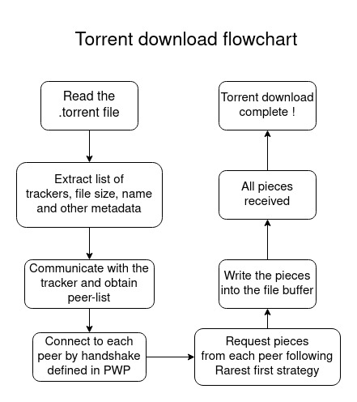

# BitTorrent Client

## Installation

```
  npm i
  node main.js [files][options]
```

## Features

- Communicate with online trackers
- Download torrent files
- Setting Download rate
- Multiple torrents at a time
- Custom download folder, number of peers

## Algorithms Implemented

- Rarest First
- Endgame
- Optimistic Unchoke
- Peer Wire protocol

## Screenshots


<!--  -->

## Torrent Download Process



## Peer Wire Protocol


## Author

- [Atharva Marathe](https://github.com/atharvamarathe)
- [Vishwajit Kadam](https://github.com/vishwajit2)
